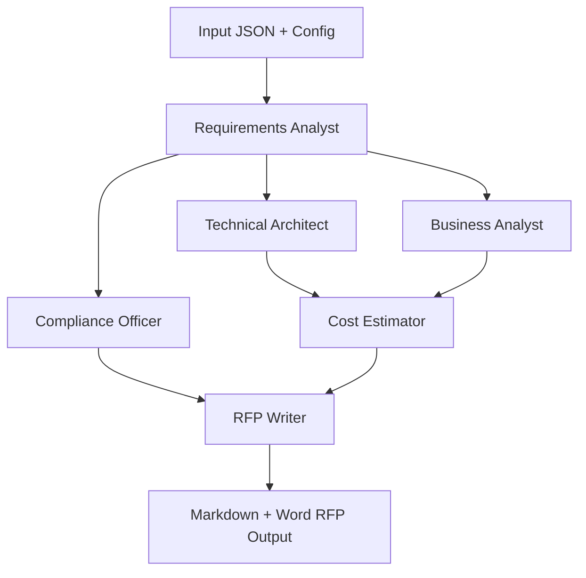

# 🤖 AI-Powered RFP Generation System

An intelligent, multi-agent system powered by [CrewAI](https://github.com/joaomdmoura/crewai) that autonomously generates enterprise-grade **Request for Proposal (RFP)** documents for large-scale technology initiatives such as data warehouses, .NET applications, cloud migrations, and more.

---

## 📌 Features

- 🧠 Autonomous CrewAI agent orchestration
- 📋 Structured `sample_project.json` input format
- 📄 Modular Jinja2-based RFP templating (Markdown & Word export)
- 📦 Integrated cost estimation, compliance validation, stakeholder matrix
- 🖥️ Streamlit UI and CLI interfaces for flexibility
- 📊 Output includes Executive Summary, Architecture, Compliance, Timeline, and Technical Appendix

---

## 🧠 Agent Architecture

The system uses **six specialized AI agents** to collaboratively draft a professional RFP:

### 🧾 Requirements Analyst
- Extracts functional, non-functional, and business requirements
- Performs stakeholder analysis, constraints, and assumptions mapping

### 🏗 Technical Architect
- Designs the technical architecture
- Selects appropriate technology stacks and ensures scalability and performance

### 💼 Business Analyst
- Defines business objectives, success metrics, and value propositions
- Aligns project scope with ROI and strategic goals

### 🛡 Compliance Officer
- Ensures requirements meet SOX, GDPR, PCI-DSS, and financial regulations
- Flags risks and suggests mitigation strategies

### 💰 Cost Estimator
- Estimates total project cost and detailed cost breakdown
- Uses configurable benchmarks from `config.yaml`

### ✍️ RFP Writer
- Compiles all insights into a polished Markdown document
- Uses Jinja2 templates and renders output in Markdown and DOCX

---

## 🔄 Agent Orchestration Workflow



Each agent works sequentially or concurrently based on task dependencies, coordinated via CrewAI's `Crew` construct.

---

## 🗂 Directory Structure

```bash
rfp_generator_system/
├── app.py                     # Streamlit UI entry
├── main.py                    # CLI entry point
├── config.yaml                # Model & agent settings
├── data/                      # Sample project JSONs
├── outputs/                   # Generated RFPs (Markdown + DOCX)
├── src/
│   ├── agents/                # Agent definitions
│   ├── tasks/                 # Tasks assigned to agents
│   ├── crews/                 # Crew & Orchestrator setup
│   ├── templates/             # Jinja2 RFP templates (base & appendix)
│   ├── tools/                 # Cost, compliance, template engines
│   ├── utils/                 # File handler, validators, RFP runner
│   └── models/                # Pydantic data models
```

---

## ⚙️ Configuration (config.yaml)

```yaml
llm:
  model: "gpt-4o"
  temperature: 0.4
  max_tokens: 8000

agents:
  requirements_analyst:
    memory: true
    max_execution_time: 300
  ...

project_templates:
  data_warehouse:
    base_template: "data_warehouse/enterprise_dw_template.md"
    technical_specs: "data_warehouse/dw_technical_specs.md"

cost_benchmarks:
  data_warehouse:
    medium: 500000
    large: 1500000
```

---

## 🚀 How to Run

### 🧪 Using CLI
```bash
python main.py \
  --input data/sample_project.json \
  --output outputs/generated_rfps \
  --verbose
```

### 🖥️ Using Streamlit UI
```bash
streamlit run app.py
```
Upload your `project.json`, click "Generate RFP", and download the final document.

---

## 📄 Output Example

- `RFP_Enterprise_Customer_Data_Platform_20250629.md`
- `RFP_Enterprise_Customer_Data_Platform_20250629.docx`

### Sample Sections:
- Executive Summary
- Project Scope & Deliverables
- Functional/Non-Functional Requirements
- Technical Architecture
- Stakeholder Matrix
- Cost Estimate Breakdown
- Vendor Evaluation Matrix
- Appendix A: Technical Specifications

---

## ✅ Use Cases
- Pre-sales proposal teams
- Enterprise architecture groups
- Procurement and sourcing departments
- AI-powered internal tooling

---

## 📋 License

MIT License. © 2025

---

## 🙋‍♂️ Contributions & Support
We welcome issues, improvements, and template contributions. Feel free to fork or open a pull request!

---

## 📬 Contact
For queries, reach out to `procurement@globaltech.com` or open an issue.
